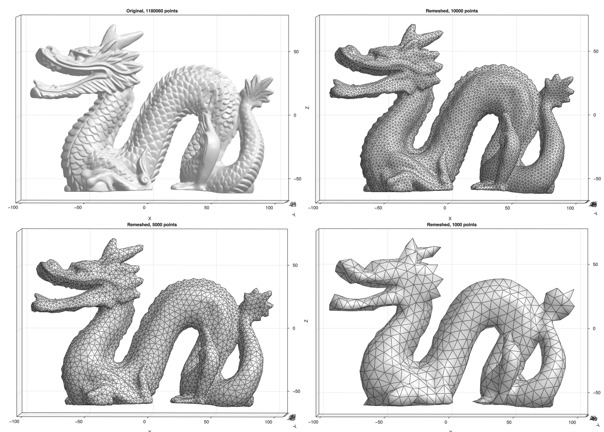

# geogram.jl

[](https://github.com/COMODO-research/Geogram.jl/blob/main/LICENSE)

## Description 
This project is a Julia wrapper for the [geogram C++ project](https://github.com/BrunoLevy/geogram). 

For the moment the only functionality exposed by this wrapper is the remeshing (`vorpalite`) functionality in Geogram, which enables smooth remeshing of surfaces. Secondly the wrapper currently works by exporting a .obj file, calling geogram as an external executable using `run` with desired parameters set, and importing of the output .obj file. In the future the wrapper should feature a more complete and efficient interface by directly interfacing with the C++ code through Julia (e.g. using `ccall`). 

  

# Installation
```julia
julia> ]
(@v1.xx) pkg> add https://github.com/COMODO-research/Geogram.jl
```

or 

```julia
julia> using Pkg
julia> Pkg.add(url = "https://github.com/COMODO-research/Geogram.jl")
```

# Getting started
To get started install the package, study the documentation, and test some of the demos provided in the [`examples`](https://github.com/COMODO-research/Geogram.jl/tree/main/examples) folder. 

# Documentation 
Under construction, see the demos provided for assistance at the moment. 

# Testing 
Under constructionm, basic manual testing is available through the demos in the examples folder. 

# Roadmap
- [x] Provide basic file export/import wrapping functionality (no `ccall` interface)
- [ ] Create proper `ccall`-based interface 

# How to contribute? 
Your help would be greatly appreciated! If you can contribute please do so by posting a pull-request. I am very much open to fully acknowledging your contributions e.g. by listing you as a contributor properly whereever possible, by welcoming you on board as a long term contributor, or by inviting you to be a co-author on publications featuring geogram.jl functionality. 

# License 
geogram.jl is released open source under the [MIT license](https://github.com/COMODO-research/Geogram.jl/blob/main/LICENSE).

# References and links for Geogram

* Geogram GitHub repository: https://github.com/BrunoLevy/geogram
* [Lévy B., Bonneel N. (2013) Variational Anisotropic Surface Meshing with
Voronoi Parallel Linear Enumeration. In: Jiao X., Weill JC. (eds)
Proceedings of the 21st International Meshing Roundtable. Springer,
Berlin, Heidelberg. doi: 10.1007/978-3-642-33573-0_21](https://doi.org/10.1007/978-3-642-33573-0_21 ) 
* http://alice.loria.fr/publications/papers/2012/Vorpaline_IMR/vorpaline.pdf
* https://www.ljll.math.upmc.fr/hecht/ftp/ff++days/2013/BrunoLevy.pdf

